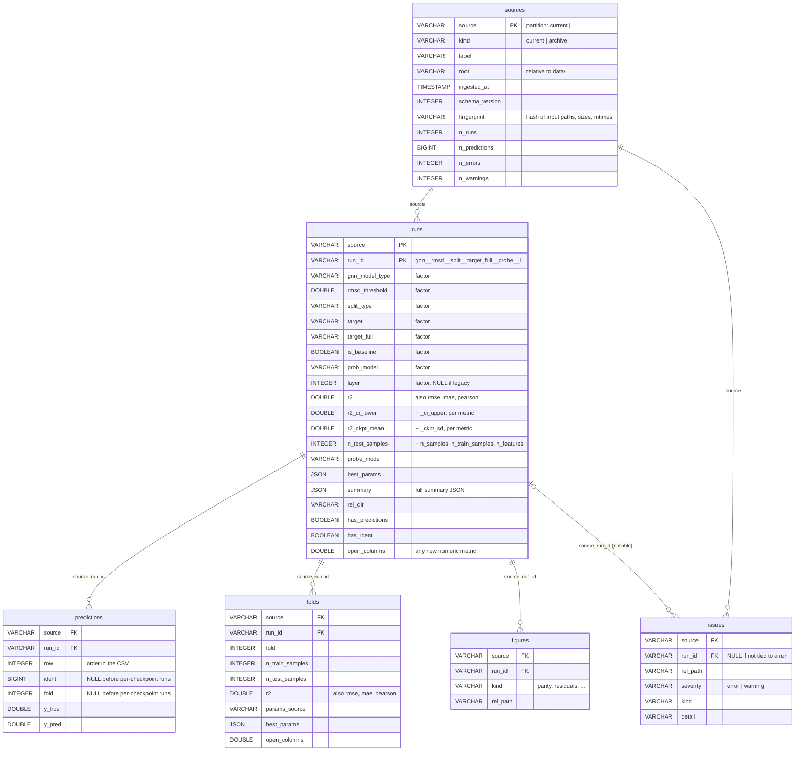

# Probing database

The probe results (run metrics, predictions, per-fold results, figure index) as
one queryable database: **DuckDB over Parquet**, one folder per source.

```bash
uv run python -m prob.db ingest     # after copying results from the cluster
uv run python -m prob.db status     # what is stored
```

```python
from prob.db import connect, load_runs, load_predictions

runs  = load_runs(source="20260929_160507", target="affinity", layer=[0, 3])
preds = load_predictions(runs.run_id[0], source="20260929_160507")

con = connect()
con.sql("SELECT target, avg(r2) FROM runs WHERE NOT is_baseline GROUP BY ALL").df()
```

## How it fits the workflow

```
cluster jobs ──write──▶ data/probing/…  (files: the source of truth)
                             │  copy to local
                             ▼
              python -m prob.db ingest ──▶ data/probing_db/source=<name>/*.parquet
                                                   │
                       notebooks / explorer ◀──────┘  connect(), load_runs(), …
```

- **The files stay the source of truth.** Probe jobs keep writing summaries,
  predictions, best params and PNGs exactly as before. Nothing here writes into
  `data/probing`. The jobs never touch the database, so parallel cluster jobs
  cannot conflict over it.
- **One source = the live sweep (`current`) or one archive snapshot.** Each is
  rebuilt on its own and swapped in whole, so a crash mid-ingest leaves the old
  version in place.
- **Re-running is cheap.** A source whose input files (paths, sizes, mtimes)
  have not changed is skipped. Re-checking the 2,500-run archive takes ~5 s and
  a full rebuild ~15 s.
- **Archiving updates it.** `prob/cluster/archive_probe_results.sh` runs
  `ingest` after a real move (set `INGEST=0` to skip).
- **Nothing is dropped silently.** Anything the ingest could not take at face
  value is a row in `issues`.

**Where is the database?** There is no single database file. The database
*is* the folder `data/probing_db/`, one Parquet file per table per source.
`connect()` opens an in-memory DuckDB session with views over those files,
so nothing is locked and nothing needs a server. To look at it outside Python,
point any Parquet reader at the folder, e.g. the DuckDB CLI:
`SELECT * FROM read_parquet('data/probing_db/*/runs.parquet', hive_partitioning=true)`.

**The explorer reads it.** `python -m prob.explorer` refreshes the database
and builds the page from it, with a **Read from: Database | Files** switch to
fall back to the files (see `prob/explorer/README.md`).

Everything lives under `data/`, which git ignores. Roots are stored relative to
`data/`, so copying the whole `data/` folder elsewhere keeps the database working.

## Schema



The full column list, with a description of each column, is in
[`schema.py`](schema.py), the single place tables are declared. The views
`connect()` creates add a few derived columns:

| View | Adds |
|---|---|
| `runs` | `<metric>_ckpt_lower/_upper` (mean ∓ sd), and absolute `exp_root`, `predictions_path`, `summary_path`, `figures_dir`: the columns `find_probe_runs` returns |
| `figures` | absolute `path` |
| `sources` | absolute `root_path` |

**Keys.** `source` is not stored inside the files. It is the folder name
(`source=<name>`), read back through Hive partitioning. Every table is keyed
by `(source, run_id)`. For real runs `run_id` is the explorer's run id, so
parity sidecars keep their names. Baselines are ordinary rows with
`is_baseline = true`, and their `run_id` contains `_shuffled_ident`.

On disk:

```
data/probing_db/
  source=current/          runs.parquet  predictions.parquet  folds.parquet
  source=20260929_160507/  figures.parquet  issues.parquet  sources.parquet
```

## Issues

| kind | severity | meaning |
|---|---|---|
| `predictions_corrupt` | error | CSV unreadable or holds non-numeric values. The run is kept, its predictions are not. |
| `summary_unreadable` | error | Summary JSON empty or invalid; metrics are NULL. |
| `best_params_unreadable` | warning | Best-params JSON empty or invalid. |
| `predictions_missing` | warning | Summary but no predictions CSV. |
| `summary_missing` | warning | Predictions but no summary JSON. |
| `predictions_count_mismatch` | warning | CSV rows ≠ the summary's `n_test_samples`. |
| `legacy_layout` | warning | Path lacks the `<layer>` level; `layer` is NULL. |
| `duplicate_run` | warning | Two files decode to the same factors; the second gets `-2`. |
| `unrecognised_path` | warning | A summary or predictions file outside any run layout. |

```bash
uv run python -m prob.db issues --summary
uv run python -m prob.db issues --severity error
```

A corrupt file is rejected whole, not partially loaded. Fix it by copying it
again from the cluster (or re-running the probe), then run `ingest`. The
changed mtime triggers the rebuild.

## Command line

| Command | What it does |
|---|---|
| `ingest [SOURCE…]` | Refresh all sources (or just the named ones), skipping unchanged ones. `--force` rebuilds anyway; `--prune` drops sources whose directory is gone (otherwise they are kept and reported as stale); `--no-archives`, `--root`, `--archive-root`, `--workers`. |
| `status` | One line per source. |
| `issues` | Flagged files; filter with `--source`, `--severity`, `--kind`; `--summary` counts per kind. |
| `sql "…"` | Run one query against the views and print the result. |

`--db-dir` (before the command) points at a database other than
`data/probing_db`.

## Recipes

```python
con = connect()

# Pair two conditions on the molecules both were tested on (per-checkpoint runs).
con.sql("""
    SELECT a.ident, a.y_true, a.y_pred AS pred_l0, b.y_pred AS pred_l3
    FROM predictions a JOIN predictions b USING (source, ident)
    WHERE a.run_id = 'CGNN-3D__rmsd2__random-k-fold__affinity__mlp__L0'
      AND b.run_id = 'CGNN-3D__rmsd2__random-k-fold__affinity__mlp__L3'
      AND source = 'current'
""").df()

# Real run next to its shuffled-ident control.
con.sql("""
    SELECT r.source, r.run_id, r.r2, b.r2 AS r2_baseline, r.r2 - b.r2 AS r2_delta
    FROM runs r JOIN runs b
      ON b.is_baseline AND NOT r.is_baseline AND b.source = r.source
     AND b.target = r.target
     AND (b.gnn_model_type, b.rmsd_threshold, b.split_type, b.prob_model, b.layer)
       = (r.gnn_model_type, r.rmsd_threshold, r.split_type, r.prob_model, r.layer)
""").df()

# Compare a condition across archive snapshots.
con.sql("SELECT source, layer, r2 FROM runs WHERE run_id LIKE 'CGNN-3D__rmsd2__random-k-fold__affinity__mlp__%' ORDER BY ALL").df()

# Any field not flattened into a column is still in the raw summary JSON.
con.sql("SELECT run_id, summary->>'$.probe_split.path' FROM runs").df()
```

## Extending it

| You want | Change |
|---|---|
| **A new metric in the summaries** (e.g. `spearman`) | Nothing. Numeric fields in `metrics_on_unseen_data`, `statistical_tests` and `across_checkpoints` become columns automatically (open columns, DOUBLE); older sources read them as NULL. Once you rely on it, declare it in `CORE_METRICS` in `schema.py` so it is always present. |
| **A new summary field that is not a number** | Read it from the `summary` JSON column, or add it to `flatten_summary` in `ingestion.py` and declare it in `RUNS`. |
| **A new factor** (e.g. `seed` as a path level) | Teach `paths_and_io._decode_pred_path` the level, add the column to `FACTOR_COLUMNS`, and add it to `run_id_for` so ids stay unique. |
| **A new per-run file** (e.g. `*_cv_results.csv`) | Declare a `Table` in `schema.py` keyed by `run_id`, find the file in `scan_source`, read it in `read_run`, and add it to `RunResult`. Storage, views and `connect()` pick up any table in `TABLES`. |
| **Change a column's type or meaning** | Edit `schema.py` and bump `SCHEMA_VERSION`. The next `ingest` rebuilds every source even though no input file changed. |

## Tests

```bash
uv run --with pytest python -m pytest prob/tests/test_db.py --no-cov --noconftest
```
